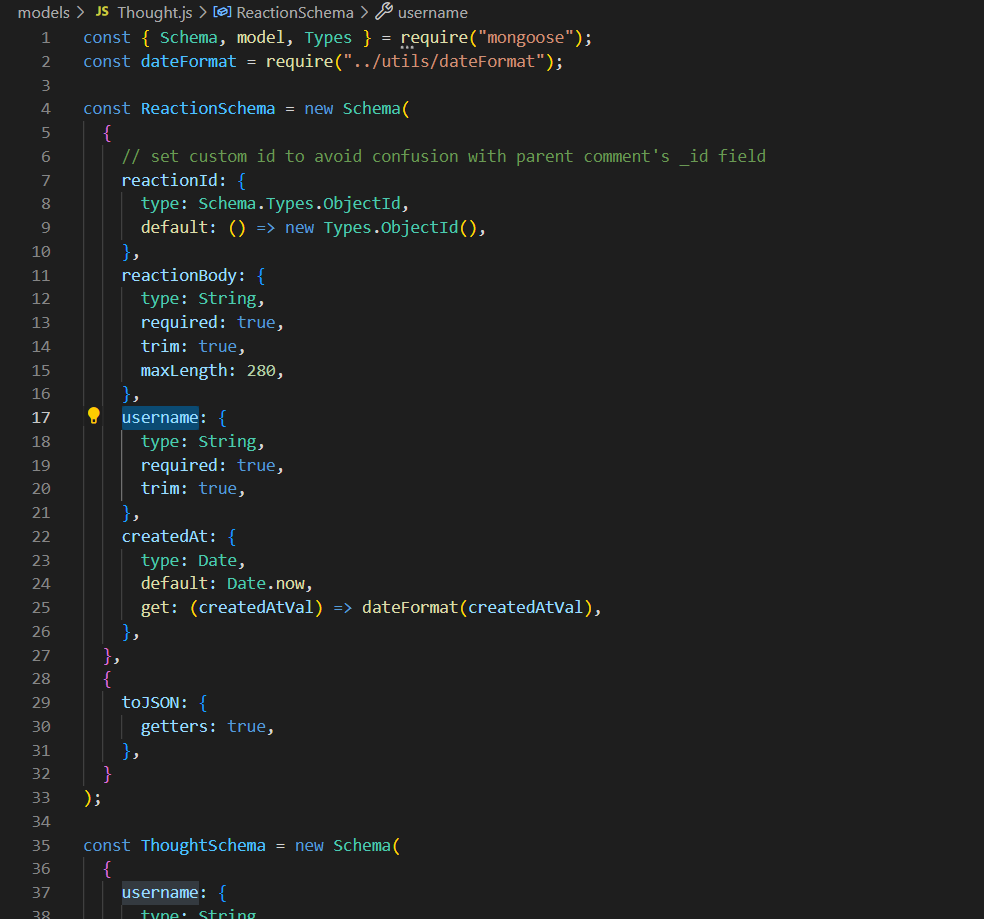
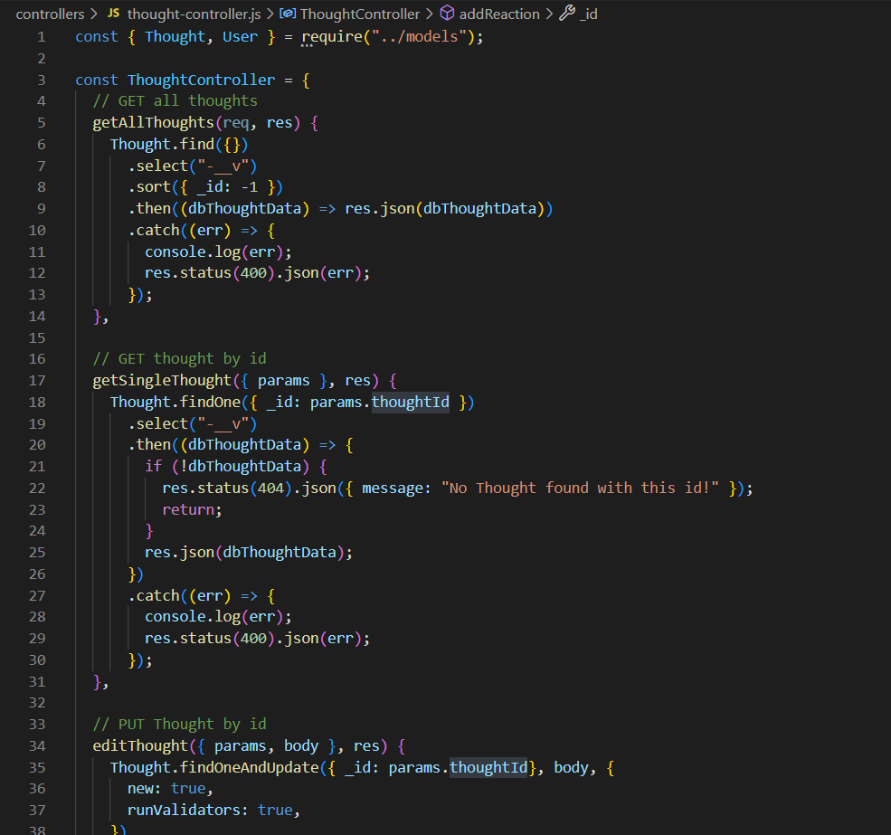
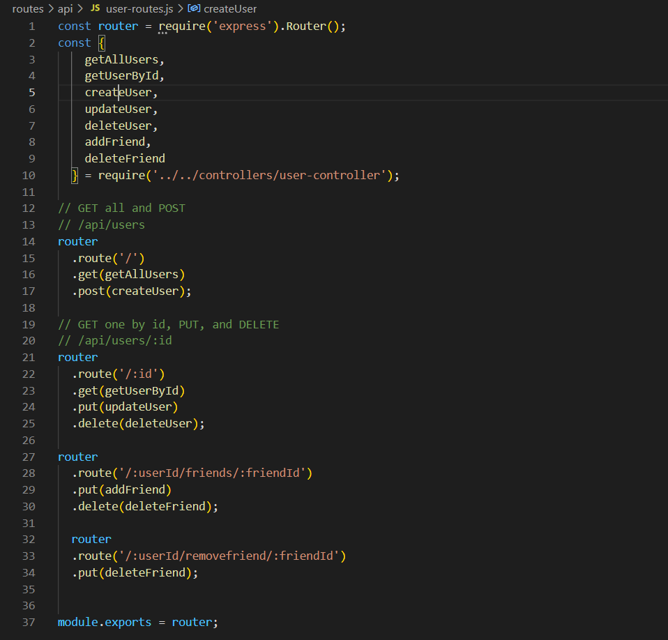

# api-for-toughts

        

## Table of Contents
- [Description](#description)
- [Installation](#installation)
- [Usage](#usage)
- [Contributing](#contributing)
- [Questions](#questions)
- [License](#license)  
        

## Description

A social media startup. 

Social-Media-Api is an application that allows for creating users, adding friends, posting and editing thoughts, and adding and deleting reactions to those thoughts. This is back end app which has an API for my social network that uses a NoSQL database - MongoDB.

So website that will be connected to app could handle large amounts of unstructured data.

## Installation

Links to the repository and the deployed page can be found at [Questions](#questions).

While this project's repository is available on Github, there is no front end, and thus it is not deployed. If you clone the repo you must run the command "npm install" on the Terminal/Command Line and download the dependencies.

## Usage

Once the project is cloned and the dependencies downloaded, type "npm start" to run server.js file. 

A screenshot of the GET User route on Insomnia is below.

Screenshots of the thought model,   

thought controller,

and user route files.

## Questions

The github repository to this project is below:

[https://github.com/sergiionyx/api-for-toughts.git](https://github.com/sergiionyx/api-for-toughts.git)

The site to a video demonstration is below:

[https://drive.google.com/file/d/1S5TEGMSM7Zakefmfl8BiiUQhTZBNFVWC/view](https://drive.google.com/file/d/1S5TEGMSM7Zakefmfl8BiiUQhTZBNFVWC/view)

For any additional questions, I can be reached at the following

Sergii Onyshchenko: twilight.cympak@gmail.com
Github: [https://github.com/sergiionyx](https://github.com/sergiionyx)

## License

[view license link here](https://choosealicense.com/licenses/mit/)

        
MIT License

Copyright (c) [2022] [willjduncan]

Permission is hereby granted, free of charge, to any person obtaining a copy
of this software and associated documentation files (the "Software"), to deal
in the Software without restriction, including without limitation the rights
to use, copy, modify, merge, publish, distribute, sublicense, and/or sell
copies of the Software, and to permit persons to whom the Software is
furnished to do so, subject to the following conditions:

The above copyright notice and this permission notice shall be included in all
copies or substantial portions of the Software.

THE SOFTWARE IS PROVIDED "AS IS", WITHOUT WARRANTY OF ANY KIND, EXPRESS OR
IMPLIED, INCLUDING BUT NOT LIMITED TO THE WARRANTIES OF MERCHANTABILITY,
FITNESS FOR A PARTICULAR PURPOSE AND NONINFRINGEMENT. IN NO EVENT SHALL THE
AUTHORS OR COPYRIGHT HOLDERS BE LIABLE FOR ANY CLAIM, DAMAGES OR OTHER
LIABILITY, WHETHER IN AN ACTION OF CONTRACT, TORT OR OTHERWISE, ARISING FROM,
OUT OF OR IN CONNECTION WITH THE SOFTWARE OR THE USE OR OTHER DEALINGS IN THE
SOFTWARE.